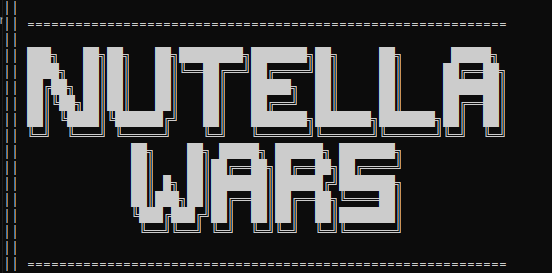
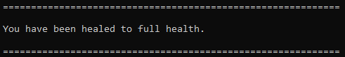
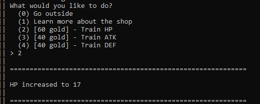
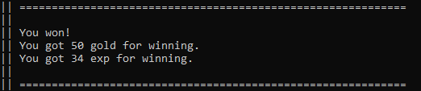
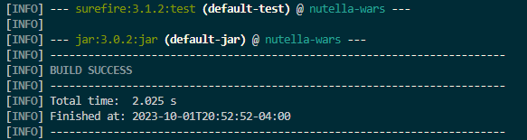

Nutella Wars
============
Table of Contents 
-----
1. [About](#about)
2. [Features](#features)
3. [History](#history)
4. [Game Play](#game-play)
    - [Jar Central](#jar-central)
    - [Hazelnut Hospital](#hazelnut-hospital)
    - [Shop](#shop)
    - [jarena](#jarena)
4. [Dependencies](#dependencies)
    - [Setting Up Apache Maven](#setting-up-apache-maven)
5. [Building](#building)
6. [Running](#running)

About
-----
Nutella Wars is a command-line, turn-based fighting game in which you play the role of a jar of Nutella.
The goal of the game is to go to the Jarena and win as many fights with other jars as possible.

Features
--------
- Save your progress and continue later
- Choose between **Offensive**, **Defensive**, and **Magical** jar classes

History
-------
I first created Nutella Wars for fun in 2010, using an old (awful) language called
[VBScript](https://en.wikipedia.org/wiki/VBScript).
In early 2017, I decided to remake Nutella Wars in Java.

Game Play
------
Using the command line, navigate to different locations within the game to train, heal, and battle other jars.

### Jar Central
Reach other locations in the game: Jarena, Hazelnut Hospitol, the Shop.

### Hazelnut Hospital
Heal your jar after battle.

### Shop
Train HP, attack (ATK), and defense (DEF) using gold won from winning battles. 

### Jarena
Participate in battles to gain exp and win gold. Visit the Hazelnut Hospital afterwards to refill your HP!

Dependencies
------------
In order to run this, you need Apache Maven installed and configured. Apache Maven requires the Java Development Kit 8 or above.

#### Setting up Apache Maven
- Download the Apache Maven Binary [here](https://maven.apache.org/install.html)
- If the binary downloaded to the downloads folder it is recommened you move it somewhere else, such as your home folder or wherever you prefer to store you APIs and Libraries.
- Unzip the file with `tar -xzf apache-maven-3.9.4-bin.tar.gz` or with your preferred unzipping tool.
- Save the path the the bin folder within the Apache Maven directory and add it to the PATH environment variable. (On Windows this can be done by searching "Advanced System Properties" in Start > Advanced > Environment Variables > User Variables ... > Path > New > then paste in the path)
- Test the installation with `mvn -v` 
- Note: Make sure to open a new terminal window after adding the folder you your PATH

Building
--------
Build the app with `mvn`

A successful build should finish like this: 

Running
-------
Run the app with `java -jar target/nutella-wars.jar`

